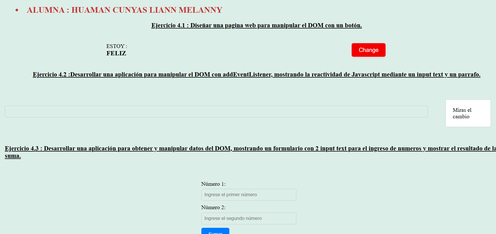

# Semana 4: JavaScript (Parte 1)

## Tema
JavaScript (Parte 1)

## Objetivo
Desarrollar aplicaciones dinámicas con JavaScript.

## ¿Qué hemos aprendido?
Durante esta semana, hemos aprendido a utilizar el operador Spread en JavaScript para diversas operaciones con arrays y strings. El Spread Operator nos permite descomponer, copiar, unir y expandir arrays y strings de manera eficiente y concisa.

## Ejercicios del Laboratorio

1. **Ejercicio 4.1**: Descomponer el siguiente array.
    ```javascript
    const alfabeto = ["a","b","c","d","e"];
    console.log(...alfabeto); // a b c d e f
    ```

2. **Ejercicio 4.2**: Copiar un array.
    ```javascript
    const array1 = ["A","B","C"];
    const array2 = [...array1];
    console.log(array1);
    console.log(array2);
    ```

3. **Ejercicio 4.3**: Unir 2 arrays.
    ```javascript
    const array1 = ["A","B","C"];
    const array2 = ["D","E","F"];
    const array3 = [...array1, ...array2];
    console.log(array3);   
    ```

4. **Ejercicio 4.4**: Expandir un String en sus caracteres individuales.
    ```javascript
    console.log([..."Texto"]); // ["T", "e", "x", "t", "o"]
    ```



## Conclusión
El operador Spread en JavaScript es una herramienta poderosa para trabajar con arrays y strings. Nos permite realizar operaciones comunes de manera más simple y legible. Esta semana nos ha brindado una comprensión sólida de cómo utilizar este operador en nuestras aplicaciones dinámicas.

## Reflexión

### Redactar un texto de reflexión metacognitivo
**¿Qué he aprendido?**
He aprendido a usar el Spread Operator en JavaScript para descomponer, copiar, unir y expandir arrays y strings. Esta herramienta me ha permitido escribir código más limpio y eficiente.

**¿Cómo he aprendido?**
He aprendido mediante la realización de ejercicios prácticos que me han permitido aplicar los conceptos teóricos. La práctica constante y la comparación de diferentes métodos han sido clave para mi comprensión.

## Bibliografía
>Intitución                 |Universidad Nacional del Centro del Perú   |
>-------------------------  | ------------------------------            |
>**Programa de Estudios:**  | Ingeniería de Sistemas                    |
>**Asignatura:**            | Desarrollo de Aplicaciones Web            |
>**Docente:**               | Jaime Suasnábar Terrel                    |
>**Alumna:**                | Liann Melanny Huaman Cunyas               |
>**Semestre:**              | IX                                        |
