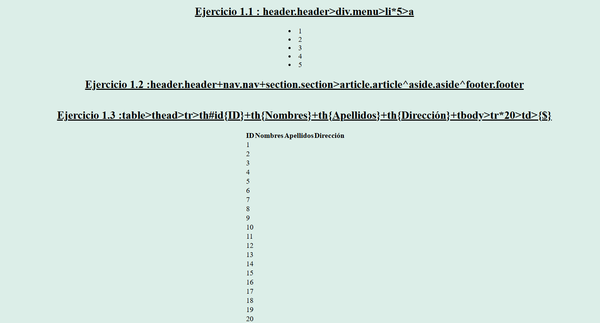

# Semana 1: Usar Visual Studio Code

## Tema
Usar Visual Studio Code

## Objetivo
Usar apropiadamente el Editor Visual Studio Code mediante el plugin Emmet y atajos de teclado de VSC.

## ¿Qué hemos aprendido?
Durante esta semana, hemos aprendido a utilizar Visual Studio Code de manera efectiva. Nos hemos enfocado en el uso del plugin Emmet, que facilita la escritura de código HTML y CSS mediante abreviaturas, y en los atajos de teclado de Visual Studio Code, que nos permiten mejorar nuestra productividad y eficiencia al programar.

## Ejercicios
1. **Ejercicio 1.1**: `header.header>div.menu>li*5>a`
2. **Ejercicio 1.2**: `header.header+nav.nav+section.section>article.article^aside.aside^footer.footer`
3. **Ejercicio 1.3**: `table>thead>tr>th#id{ID}+th{Nombres}+th{Apellidos}+th{Dirección}+tbody>tr*20>td{$}`
4. **Ejercicio 1.4**: `table>tbody>tr*20>td[id=fila$$]{fila20-$$}+td`
5. **Ejercicio 1.5**: `table.table>thead>tr>th[scope="col"]{#}+th[scope="col"]{First}+th[scope="col"]{Second}+th[scope="col"]{Three"}+tbody>tr*3>th[scope="row"]{$}+td{Mark}+td{Otto}+td{Jhonson}`

Los ejercicios pueden descargarse para tener la solución en HTML y CSS.

## Conclusión
El uso de herramientas como Visual Studio Code, junto con plugins y atajos de teclado, es esencial para cualquier desarrollador web. Estos recursos no solo aceleran el proceso de desarrollo sino que también mejoran la calidad del código y facilitan el mantenimiento del mismo. La práctica constante y la exploración de nuevas funcionalidades de VSC nos permitirán seguir mejorando nuestras habilidades.

## Reflexión

### Redactar un texto de reflexión metacognitivo
**¿Qué he aprendido?**
He aprendido a utilizar Visual Studio Code de manera más eficiente mediante el uso del plugin Emmet y los atajos de teclado. Ahora soy capaz de escribir código HTML y CSS más rápidamente y con menos errores, lo que mejora mi productividad como desarrolladora web.

**¿Cómo he aprendido?**
He aprendido mediante la práctica constante y la exploración de las funcionalidades de Visual Studio Code. Además, las sesiones de clase y las guías proporcionadas por el docente han sido fundamentales para comprender cómo utilizar estas herramientas de manera efectiva. La combinación de teoría y práctica me ha permitido asimilar mejor los conceptos y aplicarlos en mis proyectos de desarrollo web.

## Bibliografía
>Intitución                 |Universidad Nacional del Centro del Perú   |
>-------------------------  | ------------------------------            |
>**Programa de Estudios:**  | Ingeniería de Sistemas                    |
>**Asignatura:**            | Desarrollo de Aplicaciones Web            |
>**Docente:**               | Jaime Suasnábar Terrel                    |
>**Alumna:**                | Liann Melanny Huaman Cunyas               |
>**Semestre:**              | IX                                        |
