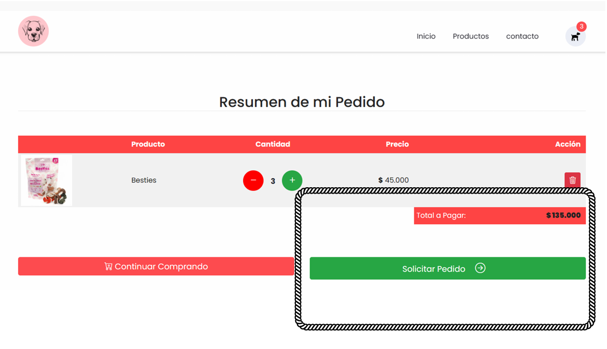

# Semana 5: Trabajo: Pasarela de Pagos y Monetización

## Tema
Trabajo: Pasarela de Pagos y Monetización

## Objetivo
Trabajo usando Stripe y Google AdSense.

## ¿Qué hemos aprendido?
Durante esta semana, hemos aprendido a implementar una pasarela de pagos utilizando Stripe y a monetizar una página web mediante Google AdSense. Estas herramientas nos permiten integrar soluciones de pago y generar ingresos a través de publicidad.

## Ejercicios del Laboratorio

1. **Ejercicio 5.1**: Configurar una cuenta de Stripe y crear una clave API para el entorno de prueba.

2. **Ejercicio 5.2**: Implementar un formulario de pago en una página web utilizando la clave API de Stripe.

3. **Ejercicio 5.3**: Configurar una cuenta de Google AdSense y generar un código de anuncio para una página web.

4. **Ejercicio 5.4**: Insertar el código de anuncio de Google AdSense en una página web y verificar la visualización de los anuncios.

5. **Ejercicio 5.5**: Integrar la pasarela de pagos de Stripe con la página web y procesar una transacción de prueba.

Puede descargar los archivos y ejecutar

## Conclusión
Implementar pasarelas de pago y monetización con herramientas como Stripe y Google AdSense es esencial para crear aplicaciones web completas y sostenibles. Estas tecnologías no solo mejoran la funcionalidad de nuestras aplicaciones, sino que también abren oportunidades para generar ingresos.

## Reflexión

### Redactar un texto de reflexión metacognitivo
**¿Qué he aprendido?**
He aprendido a configurar y utilizar Stripe para procesar pagos en línea y a implementar Google AdSense para monetizar una página web con anuncios.

**¿Cómo he aprendido?**
He aprendido a través de la configuración práctica de cuentas y la integración de estas herramientas en una página web. La experiencia directa y la resolución de problemas durante la implementación me han ayudado a entender mejor los procesos y las mejores prácticas.

## Bibliografía
>Intitución                 |Universidad Nacional del Centro del Perú   |
>-------------------------  | ------------------------------            |
>**Programa de Estudios:**  | Ingeniería de Sistemas                    |
>**Asignatura:**            | Desarrollo de Aplicaciones Web            |
>**Docente:**               | Jaime Suasnábar Terrel                    |
>**Alumna:**                | Liann Melanny Huaman Cunyas               |
>**Semestre:**              | IX                                        |
