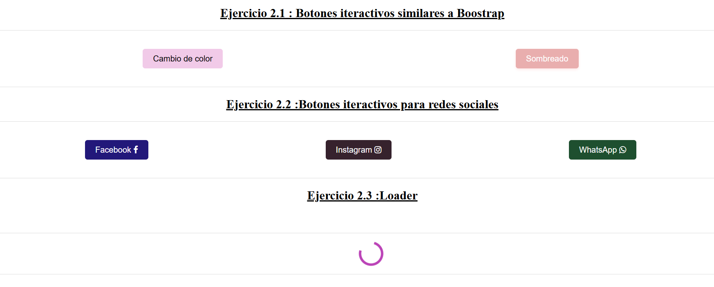

Claro, aquí tienes el contenido con la imagen añadida después de los enunciados de los ejercicios:

```markdown
# Semana 2: HTML y CSS

## Tema
HTML y CSS

## Objetivo
Usar HTML y CSS para diseñar elementos utilizables en la web y para desarrollar componentes de una página web.

## ¿Qué hemos aprendido?
Durante esta semana, hemos aprendido a utilizar HTML y CSS para diseñar y desarrollar componentes web interactivos. Hemos trabajado en la creación de botones, íconos de redes sociales, animaciones de carga y estructuras de páginas responsivas.

## Ejercicios del Laboratorio
1. **Ejercicio 2.1**: Diseñar botones interactivos similar a Bootstrap utilizando las clases `btn success`, `info`, etc.
2. **Ejercicio 2.2**: Diseñar botones interactivos para redes sociales utilizando clases (fa fa-facebook etc) y caracteres similar a Font Awesome. Utilizar iconos de: fontawesome.
3. **Ejercicio 2.3**: Diseñar un loader (animación de precarga) como un anillo que gira con animación infinita.
4. **Ejercicio 2.4**: Diseñar la estructura de página responsiva.
5. **Ejercicio 2.5**: Desarrollar una página web solo usando HTML y CSS que contenga un sidebar con 2 modos de visualización: claro y oscuro. Agregar un botón para cambiar el modo.
6. **Ejercicio 2.6**: Desarrollar una página web solo usando HTML y CSS que contenga un sidebar con 2 modos de visualización: contraído y expandido. Agregar un botón para cambiar el modo.



Los ejercicios pueden descargarse para tener la solución en HTML y CSS.

## Conclusión
El uso de HTML y CSS es fundamental para el desarrollo de interfaces web interactivas y atractivas. A través de estos ejercicios, hemos aprendido a aplicar estilos avanzados y a crear estructuras responsivas que mejoran la experiencia del usuario. La práctica continua y la experimentación con diferentes técnicas nos permitirán seguir perfeccionando nuestras habilidades en el diseño y desarrollo web.

## Reflexión

### Redactar un texto de reflexión metacognitivo
**¿Qué he aprendido?**
He aprendido a utilizar HTML y CSS para diseñar y desarrollar componentes web interactivos, como botones, íconos de redes sociales y animaciones de carga. También he aprendido a crear estructuras de página responsivas que se adaptan a diferentes tamaños de pantalla.

**¿Cómo he aprendido?**
He aprendido mediante la realización de ejercicios prácticos que me han permitido aplicar los conceptos teóricos aprendidos en clase. La experimentación y la resolución de problemas me han ayudado a entender mejor cómo utilizar HTML y CSS para crear interfaces web efectivas.


## Bibliografía
>Intitución                 |Universidad Nacional del Centro del Perú   |
>-------------------------  | ------------------------------            |
>**Programa de Estudios:**  | Ingeniería de Sistemas                    |
>**Asignatura:**            | Desarrollo de Aplicaciones Web            |
>**Docente:**               | Jaime Suasnábar Terrel                    |
>**Alumna:**                | Liann Melanny Huaman Cunyas               |
>**Semestre:**              | IX                                        |
